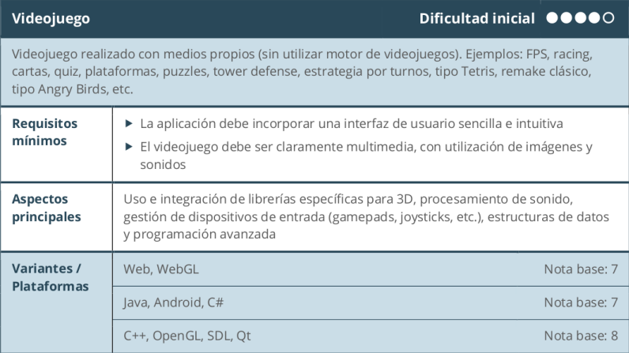
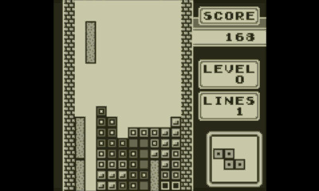
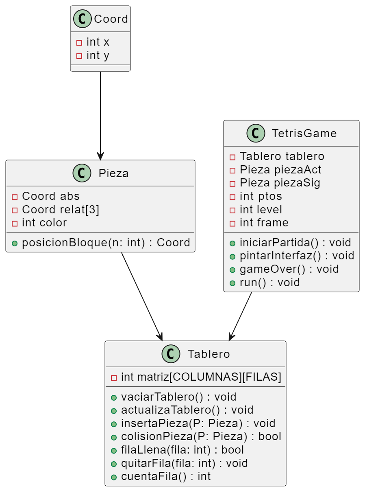

# README.md

# Proyecto Elegido: Tetris 2D


## Autor del proyecto: Francisco José Escabias Ortega

### Proyecto elegido: Videojuego Tetris 2D


### Lenguaje de programación: C/C++

### IDE utilizado: CLion

### Resultado esperado a conseguir:

Interfaz gráfica simple y pequeña para poder jugar al tetris como en los viejos tiempos.



Los **EXTRAS** de este videojuego podrían ser:

- Incorporar música del Tetris mientras juegas (sin Copyright)
- Interfaz de ventana de título para seleccionar el comienzo de la partida o cerrar el juego.

## Bibliotecas

Biblioteca Gráfica a usar: ***Miniwin.h***

Esta biblioteca de Pau Fernández realizada en C/C++/CodeBlocks es un mini-conjunto de funciones para abrir una ventana, pintar en ella y detectar la presión de algunas teclas. Lo justo para poder implementar juegos sencillos sin necesidad de OpenGL como se hizo en la asignatura de Informática Gráfica y Visual.

El código pertinente y la documentación de las funciones a utilizar está colgada en su GitHub para su total acceso libre.

Documentación de MiniWin: [https://miniwin.readthedocs.io/en/latest/Utilizacion.html](https://miniwin.readthedocs.io/en/latest/Utilizacion.html)

Miniwin es una clase de C++ compuesta por dos ficheros miniwin.h y miniwin.cpp. Para poder usar esta clase, sólo hay que abrir un nuevo proyecto en CLion y agregar los ficheros a la carpeta raíz.

En el resto de archivos que utilicen la biblioteca, habrá que agregar las siguientes líneas de código:

```
#include "miniwin.h"
using namespace miniwin;
```

Biblioteca para música a usar: ***mmsystem.h***

Esta biblioteca de C incluye una función muy cómoda para comenzar a reproducir tu música descargada y localizada en la raíz de tu proyecto.

```java
PlaySound(TEXT("../tetris.wav"), NULL, SND_FILENAME | SND_ASYNC | SND_LOOP);
```

Para incluirla, únicamente necesitaremos incluir la dependencia correspondiente:

```java
#include <mmsystem.h>
```

## Referencias y Consultas

Referencias consultadas por el momento:

- Lectura detenida del manual de MiniWin con su rápida instalación y prueba de dibujo de algunos elementos gráficos como puntos, líneas, rectángulos...
- Jugar mucho al Tetris: Hay múltiples versiones e instrucciones... Me guío por el Original de la Game Boy
- Analizar patrones de piezas, tablero, puntuaciones, niveles y aparición y movimiento automático de las piezas. Me apoyo de vídeos que explican (sobre todo con dibujos) el funcionamiento interno del juego para poder entender su lógica y poder programarlo.
- Vídeos explicativos en YouTube de Pau Fernández explicando las pequeñas trabas más difíciles para hacer el juego como son quitar líneas, colisionar piezas o rotarlas…

## Diseño y Análisis de Solución

Tras haber consultado las distintas fuentes de información, en un principio, la estructura del UML podría ser de la siguiente manera:



Aquí una pequeña explicación de lo que cada atributo/método de cada clase representa en el juego del Tetris:

### Clase Coord

```
Atributos:
	int x: Coordenada x.
	int y: Coordenada y.
Funciones:
	Ninguna función específica.
Propósito:
	Representa coordenadas x e y en el espacio bidimensional.

```

### Clase Pieza

```
Atributos:
	Coord abs: Coordenada del bloque central.
	Coord relat[3]: Coordenadas de bloques periféricos.
	int color: Color de la pieza.
Funciones:
	Coord posicionBloque(int n): Devuelve la coordenada absoluta de un bloque ‘n’ relativo o central.
Propósito:
	Representa una pieza del Tetris con su posición y forma.

```

### Clase Tablero

```
Atributos:
	int matriz[COLUMNAS][FILAS]: Matriz que representa el estado del tablero.
Funciones:
	void vaciarTablero(): Establece todas las celdas del,tablero como vacías.
	void actualizaTablero(): Redibuja las celdas ocupadas del tablero.
	void insertaPieza(const Pieza& P): Coloca una pieza en el tablero.
	bool colisionPieza(const Pieza& P): Verifica si una pieza colisiona con el tablero.
	bool filaLlena(int fila): Verifica si una fila está completamente llena.
	void quitarFila(int fila): Desplaza las filas superiores hacia abajo cuando una fila está llena.
	int cuentaFila(): Cuenta y elimina las líneas llenas del tablero.
Propósito:
	Gestiona el estado y las operaciones del tablero de juego.

```

### Clase TetrisGame

```
Atributos:
	Tablero tablero: Tablero de juego.
	Pieza piezaAct: Pieza que está en juego.
	Pieza piezaSig: Siguiente pieza a ser utilizada.
	int ptos: Puntuación acumulada.
	int level: Nivel actual del juego.
	int frame: Contador de tiempo para controlar el movimiento automático hacia abajo.
Funciones:
	void iniciarPartida(): Inicializa el juego y las piezas.
	void pintarInterfaz(): Actualiza la pantalla de juego.
	void gameOver(): Muestra el mensaje de "Game Over".
	void run(): Controla el bucle principal del juego.
Propósito:
	Gestiona el flujo del juego, controla las interacciones con el jugador.

```

Para terminar decir que todo esto es PROVISIONAL y puede que algunas de las funciones explicadas anteriormente no se lleguen a hacer o incluso aparezcan nuevas funciones por lances del proyecto o bien por cambio de metodología, pero actualmente es la aproximación más adecuada que tengo en mente para realizar el juego del Tetris.

## Modificaciones finales tras acabar el proyecto

Finalmente, el diseño de clases orientado a objetos no se ha tenido en cuenta. En su defecto, para organizar y poder hacer un código más legible, se hace uso de los struct y typedef de C. Veamos su utilización:

### Struct Coord

```
struct Coord {
    int x; ///< Coordenada x
    int y; ///< Coordenada y
};
```

### Struct Pieza

```
struct Pieza {
    Coord abs; ///< Coordenadas absolutas de la pieza
    Coord relat[3]; ///< Coordenadas relativas de la pieza
    int color; ///< Color de la pieza

    /** @brief Obtiene la posición del bloque.
     *  @param n Índice del bloque (0 = absoluto, entre 1 y 3 = relativos)
     *  @return Coordenadas del bloque.
     */
    Coord posicionBloque(int n) const {
        if (n == 0) return abs;
        return {abs.x + relat[n - 1].x, abs.y + relat[n - 1].y};
    }
};
```

### Typedef Tablero:

```
typedef int Tablero[COLUMNAS][FILAS]; ///< Tablero del juego
```

A efectos de funciones mencionadas en el diseño preliminar, estas se han hecho de manera exacta a cómo se plantearon, cada una de manera desacoplada en el único fichero que tiene el proyecto y actúa como main: tetris.cpp

Para más detalle de código y ver cómo funciona, recomiendo echar un vistazo al fichero mencionado y claramente documentado. Queda el proyecto a total uso libre y disposición de quien quiera usarlo para jugar.

## Instrucciones de Juego

- Tecla → : Mover pieza derecha
- Tecla ← : Mover pieza izquierda
- Tecla ↑ : Girar pieza sentido horario
- Tecla ↓ : Mover pieza abajo
- Tecla 'X' : Girar pieza sentido antihorario
- Tecla 'Z' : Girar pieza sentido horario
- Tecla 'Esc' : Salir de la pantalla

## Instrucciones de Descarga

**Opción 1: Run desde Clion** 

Visita el Repositorio https://github.com/fjeo0002/Tetris y descarga el ZIP.
Abre CLion. En la ventana para configurar el .exe, pulsa "Ok".
Pulsa "Run" o Mayus+F10

**Opción 2: Run desde .exe** 

Visita el Repositorio https://github.com/fjeo0002/Tetris y descarga el ZIP.
Abre la carpeta /exe y haz doble clic en "Tetris.exe"

## Video demostrativo

Se añade un breve video de no más de 3 minutos que muestra el funcionamiento básico del juego:

[](https://www.youtube.com/watch?v=kLm36WbHJKo)